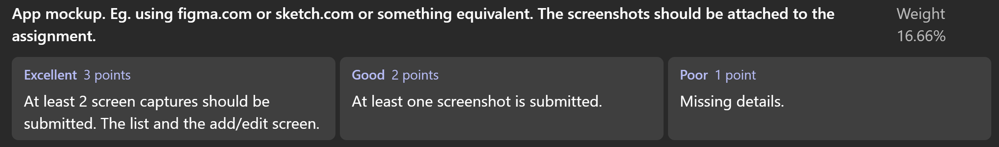

## ListManager App

**ListManager** is a mobile application that helps store owners and employees easily identify and manage missing products during inventory.

Instead of writing down items manually, users can **walk through the warehouse and use voice commands** to dictate the products they can’t find. The app automatically searches for these products in the local database and **groups them by distributor**.

When a product is **not found**, users have the option to **add it manually**, along with the corresponding **distributor information**.  
At the end of the process, ListManager automatically **generates PDF files** for each distributor, simplifying the restocking workflow and saving valuable time.

---

### Key Features
-  Voice command input for missing products  
-  Automatic product search and grouping by distributor  
-  Ability to add new products and distributors  
-  PDF generation for each distributor’s restocking list  
- Faster and easier inventory management  

--- 

## Domain Model 

### Core Entities

#### 1. `Distributor Entity`
Represents product suppliers/distributors.

**Fields:**
- `id`: Long (Primary Key, auto-generated)
- `distributorName`: String (Unique, indexed)

**Purpose:** Organize products by their source/supplier.

#### 2. `Product Entity`
Represents individual products in the catalog.

**Fields:**
- `id`: Long (Primary Key, auto-generated)
- `name`: String (Product name)
- `distributorId`: Long (Foreign Key to Distributor)
- `aliases`: String (Comma-separated alternative names for voice recognition)

**Purpose:** Store product catalog with voice-friendly aliases.

#### 3. `Session Entity`
Represents a shopping session/order.

**Fields:**
- `id`: Long (Primary Key, auto-generated)
- `name`: String (Session name, default: "Session")
- `createdAt`: Long (Timestamp)
- `isActive`: Boolean (Only one active session at a time)

**Purpose:** Group products being ordered together.

#### 4. `SessionItem Entity`
Represents products added to a session with quantities.

**Fields:**
- `id`: Long (Primary Key, auto-generated)
- `sessionId`: Long (Foreign Key to Session)
- `productId`: Long (Foreign Key to Product)
- `quantity`: Int (Number of units)

**Purpose:** Track what products and quantities are in each session.

#### 5. `UnknownProduct Entity`
Stores voice inputs that couldn't be matched to catalog products.

**Fields:**
- `id`: Long (Primary Key, auto-generated)
- `spokenText`: String (The unrecognized voice input)

**Purpose:** Queue unrecognized products for later manual cataloging.

---

## ⚙️ CRUD Operations

---

### 🟢 CREATE
- **Distributors** are created automatically when adding new products or manually from the catalog.  
- **Products** can be added by reviewing unknown entries, naming them, selecting a distributor, and adding optional aliases for better voice recognition.  
- **Sessions** are created automatically when starting a new ordering process (only one active at a time).  
- **Session items** are added through voice input; duplicates increase quantity instead of creating new entries.  
- **Unknown products** (low voice confidence) are stored for review and can later be added to the catalog.

---

### 🔵 READ
- View **distributors** and their product counts from the catalog.  
- View **products** grouped by distributor with search and alias filtering.  
- View **sessions** showing all items, quantities, and distributors.  
- View **unknown products** in a dedicated screen, sorted by most recent.

---

### 🟠 UPDATE
- Adjust **quantities** instantly with plus/minus buttons (0 removes item).  
- Edit **product names** and **aliases** to improve recognition.  
- Edit **distributor names** directly in the catalog.  
- **Sessions** close automatically after PDF generation.

---

### 🔴 DELETE
- Remove individual or all **session items** (auto-cleared after PDF).  
- Delete **unknown products** manually or when converting to real products.  
- Delete **products** (removes them from catalog, sessions, and search).  
- Delete **distributors** (removes all related products and session items).  

## 🗄️ Data Persistence

ListManager uses a **hybrid persistence model** that stores data both **locally (Room/SQLite)** and on a **remote server** for synchronization across users and devices. 
---

### 📍 Local Database 

All CRUD operations are saved locally so the app works without an internet connection.  
When online, all local changes automatically sync with the server.

#### ✅ CREATE
- Saves new **distributors**, **products**, **sessions**, and **voice-recognized items**.  
- **Unknown products** are stored locally for later review.

#### ✅ READ
- Retrieves all **catalogs**, **sessions**, and **search results** directly from local storage.  
- Provides instant access to data without needing a network connection.

#### ✅ UPDATE
- Stores all **quantity**, **alias**, or **name** changes locally.  
- Session status and updates persist after app restarts.

#### ✅ DELETE
- Removes items or sessions immediately.  
- **Cascade deletions** ensure that linked data (e.g., distributor → products) stays consistent.

---

### ☁️ Server Persistence 

When connected, the app automatically syncs with the server for shared use across devices.

#### 🔄 CREATE
- Uploads new products, distributors, and sessions to the server with timestamps and IDs.  
- Example: Adding “Milk” becomes visible to all users in the same group.

#### 🔍 READ
- Downloads the latest data from the server and updates the local cache.  
- Users see real-time changes made by others.

#### ✏️ UPDATE
- Any change made locally is synced to the cloud and shared with all connected devices.  
- Uses **last-write-wins** logic to avoid conflicts.

#### 🗑️ DELETE
- Deletions are reflected on the server and across all devices.  
- Prevents duplicates and maintains consistency.

---

### 🔁 Example: Real-Time Collaboration 

**Context:**  
A chain of stores or departments collaborates in real-time on shared orders.

**How Persistence Works:**
Shared Server Database
├─ Employee A → adds “Milk”
├─ Employee B → adds “Juice”
└─ Employee C → removes “Bread”

→ All updates sync across devices instantly

| Operation | Local DB | Server Sync | Example Use |
|------------|-----------|-------------|--------------|
| **CREATE** | ✅ | ✅ | Adding a product to session |
| **READ** | ✅ | ✅ | Distributor viewing live orders |
| **UPDATE** | ✅ | ✅ | Adjusting quantities or product names |
| **DELETE** | ✅ | ✅ | Removing items after delivery |
| **OFFLINE MODE** | ✅ | 🔁 Syncs later | Orders saved locally until reconnected |

---

## 🌐 Offline Functionality

This application works **100% offline** — no internet connection required.  
All CRUD operations are supported locally through the **Room (SQLite)** database.  
When reconnected, changes are synced automatically with the server.

---

### 🟢 Scenario 1: CREATE (Add Products While Offline)

**What happens:**
1. User opens app (no internet).
2. Uses microphone to say a product name.
3. Offline speech recognition converts voice to text.  
4. App searches local product database.
5. Product is added to the active session.
6. Data is saved in the local Room database.

**Result:** New products and sessions can be created offline. ✅

---

### 🔵 Scenario 2: READ (View Catalog and Sessions Offline)

**What happens:**
1. User opens the Catalog screen.  
2. All data (products, distributors, sessions) loads from the local database.  
3. Search and filters work instantly using the local full-text index.

**Result:** Catalog browsing and search are fully functional offline. ✅

---

### 🟠 Scenario 3: UPDATE (Modify Products and Quantities Offline)

**What happens:**
1. User opens an active session.  
2. Adjusts product quantities or edits product names and aliases.  
3. All updates are written instantly to the local database.  
4. Changes remain saved even after closing or restarting the app.

**Result:** Updates persist locally until sync is available. ✅

---

### 🔴 Scenario 4: DELETE (Remove Items or Sessions Offline)

**What happens:**
1. User removes a product from the current session.  
2. Deletion instantly updates the local database.  
3. Cascade rules remove related session data (if any).  
4. When connection is restored, deletions are synced to the server.

**Result:** Items and sessions can be safely deleted offline. ✅

---

### 🧾 Scenario 5: Generate PDFs Offline

**What happens:**
1. User finalizes a session and taps “Generate PDF”.  
2. App retrieves data from the local database.  
3. Groups products by distributor and generates PDFs using the local engine.  
4. Files are saved to the device storage for later sharing.

**Result:** Professional PDF reports can be created offline. ✅

---

### ✅ Summary: What Works Offline

| Feature | Works Offline | Description |
|----------|----------------|-------------|
| **Voice Input** | ✅ | Uses built-in speech recognition |
| **Product Search** | ✅ | Full-text search in local DB |
| **Add/Edit/Delete** | ✅ | Fully persisted locally |
| **Session Management** | ✅ | Saved and restored offline |
| **PDF Generation** | ✅ | Created from local data |
| **Sync on Reconnect** | 🔁 | Automatic upload to server |

---

<table>
  <tr>
    <th>Voice Recognition</th>
    <th>Similarity Search</th>
    <th>Product Catalog</th>
    <th>PDF Generator</th>
    <th>Unknown Products</th>
    <th>Current Session</th>
  </tr>
  <tr>
    <td align="center"></td>
    <td align="center"></td>
    <td align="center"></td>
    <td align="center"></td>
    <td align="center"></td>
    <td align="center"></td>
  </tr>

